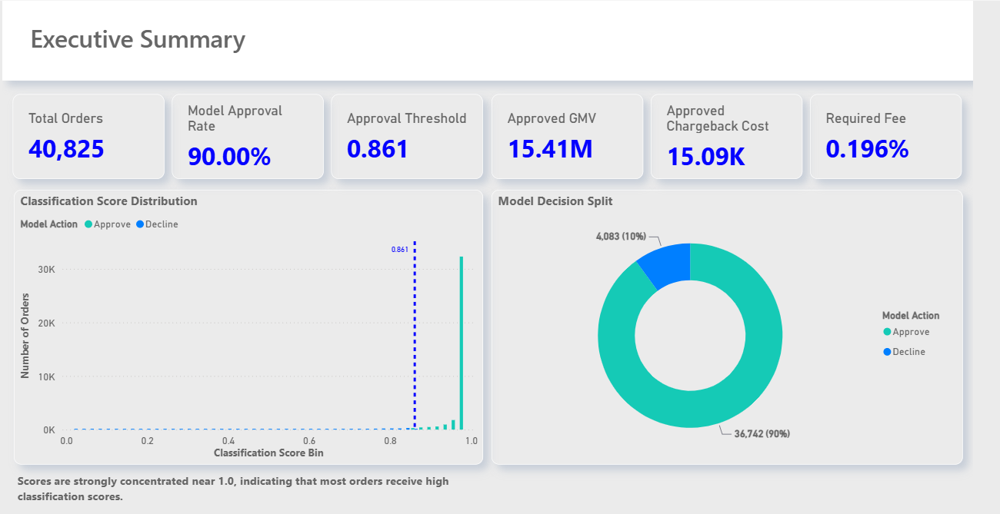

# Payment Risk & Chargeback Analytics

<a href="https://app.powerbi.com/view?r=eyJrIjoiYzk4MmY2MDYtZmE4My00ZDU4LTg4YTctYjc2NDVlMmZkZmU0IiwidCI6IjM1ODAxOWMyLWZmMWQtNGRlOC04MDBlLTk2YTRkMzgwNzMwYyIsImMiOjl9" rel="nofollow">Sales Performance Dashboard</a>

Power BI risk analytics project developed to evaluate transaction approval decisions, chargeback exposure and the financial impact of a risk classification model.

The dashboard connects model performance with business outcomes by analysing approval rates, classification thresholds, approved GMV, chargeback costs and the revenue required to absorb fraud-related losses.

## Business Objective

The analysis focuses on balancing two competing objectives:

- Approving legitimate transactions and protecting revenue
- Controlling chargeback exposure and associated financial losses

The dashboard also explores which customer, product and channel characteristics are associated with higher observed chargeback risk.

## Dashboard Pages

### Executive Summary

Provides a high-level view of model decisions and business impact, including:

- Total Orders
- Model Approval Rate
- Approval Threshold
- Approved GMV
- Approved Chargeback Cost
- Required Fee
- Classification Score Distribution
- Approval vs. Decline split

The classification score distribution helps evaluate how order scores relate to the selected approval threshold.

### Business Model Analysis

Connects risk decisions with their financial impact.

Key metrics include:

- Model Approved Orders
- Approved Chargeback Orders
- Approved GMV
- Approved Chargeback Cost
- Required Revenue
- Required Fee

The analysis estimates the fee required on approved GMV to generate sufficient revenue relative to observed chargeback losses.

### Risk Segmentation

Explores how chargeback behaviour varies across different business dimensions.

Analysis includes:

- Digital vs. tangible products
- Chargeback count rate
- Chargeback amount rate
- Customer account age
- Order source
- Digital-to-tangible risk multiples

This allows higher-risk segments to be identified without assuming that every observed difference is necessarily caused by the segment itself.

## Key Insights

- The model approves approximately 90% of analysed orders.
- Classification scores are strongly concentrated near the upper end of the score range.
- Approved transactions represent the majority of GMV while retaining measurable chargeback exposure.
- Digital products show higher observed chargeback rates than tangible products in both count and amount terms.
- Recently created customer accounts show higher observed chargeback rates than several older account-age groups.
- Mobile App transactions show a higher observed chargeback rate than Web transactions, although differences in sample size should be considered when interpreting the result.

## Business Decisioning

The project demonstrates how risk-model outputs can be translated into business metrics.

Rather than analysing model scores in isolation, the dashboard connects:

**Classification Score → Approval Decision → GMV → Chargeback Exposure → Revenue Requirement**

This makes it possible to evaluate the commercial implications of an approval strategy alongside its risk performance.

## Tools & Techniques

- Power BI
- DAX
- Power Query
- Data Modeling
- Risk Analytics
- KPI Design
- Threshold Analysis
- Customer Segmentation
- Financial Impact Analysis
- Data Visualization

## Dashboard Preview

